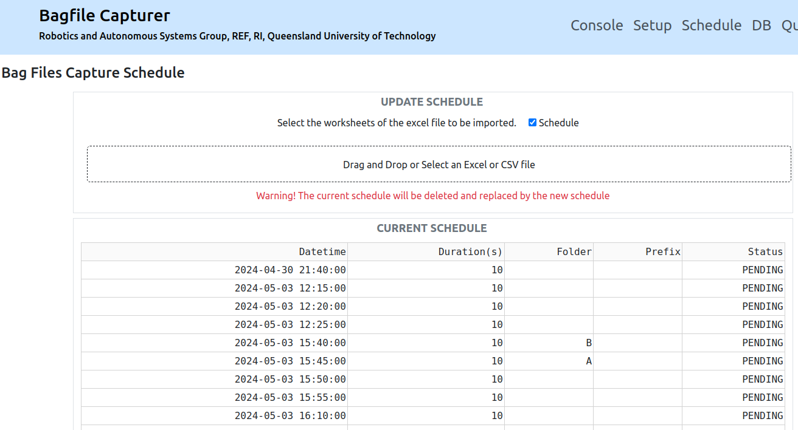

# Scheduled Bagfiles Capturer

 [](https://opensource.org/licenses/BSD-3-Clause)

**Robotics and Autonomous Systems Group, Research Engineering Facility, Research Infrastructure** 
**Queensland University of Technology**

## Introduction

The scheduled bagfiles capturer is a ROS 1 (noetic) application node that captures bag files according to a schedule. It is designed to operate autonomously and remotely, and to work with another application that uploads the captured bag files to a cloud storage (such as Google Drive)

The schdule, which is part of an Excel file containing other system settings, can be live updated by pulling it from a Google Drive or by uploading through a web application.

The application can operate in web-based mode or headless mode. 

In the web-based mode, users can interact with the application hrough a web interface. The interface provides a console for monitoring the application status and various web pages for updating the schedule and other bagfile capturing parameters.

In the headless mode, users cannot directly interact with the application. The schedule can be updated via editing a publicly link-shared Excel file on the Google Drive. In addition, the application will write event messages to a daily log file.

## Software Requirements and Installation Guide

This application is a package based on ROS 1 (noetic) and Python 3.8 (or above). It uses a number of third party Python modules as specified in `requirements.txt`.

### Step-by-step Installation
1. Create a catkin workspace or use an existing one.
```
mkdir -p ~/catkin_ws/src
cd ~/catkin_ws/src
```
2. Clone this repository under the `src` directory.
```
git clone git@github.com:REF-RAS/bagfiles_capturer.git
```
3. Build this package.
```
rosdep install --from-paths src --ignore-src -r -y --rosdistro noetic
source /opt/ros/noetic/setup.bash
catkin_make -DPYTHON_EXECUTABLE=/usr/bin/python3
```
4. Start the application. The application should start even though some of the configuration parameters need changing.
```
cd ~/catkin_ws
source devel/setup.bash
rosrun bagfiles_capturer run.py
```
5. Test the application using a web browser.
Point the web browser to `http://0.0.0.0:8060`, which is the default URL for the web interface. The following web interface should appear.


## The Configuration yaml File

The configuration file `config/capturer_config.yaml` must be edited so that the application can run properly. The following goes through every parameter.

```yaml
capturer.mode: web   # web or headless
```
Determines whether the bagfiles capturer provides a web interface (`web`) or no interface (`headless`). Other values will cause an error.
```yaml
capturer.web.host: 0.0.0.0
capturer.web.port: 8060
capturer.web.debug.mode: True       # whether the web interface provides debugging information
capturer.web.launch_browser: False  # whether to launch the web browser when the application starts
```
Determines the host IP and the port number of the web interface. The `True` value for the `debug.mode` instructs the web interface to provide debugging information. Changing from `False` to `True` for `capturer.web.launch_browser` tells the application to launch the web browser and point it at the given host IP and port number.
```yaml
capturer.web.auth: True   # Authentication required if web mode
```
Determines if user/password authentication is enabled. Note that for the authentication to be really enabled, at least one account has to be added to the application through the system settings Excel file.
```yaml
capturer.pull.gdrive.fileid: null  # null if no pull setting
capturer.pull.cron.schedule: '0 * * * *'
```
Determines if the application regularly pull the system settings Excel file from Google Drive. The key `capturer.pull.gdrive.fileid` refers to the file ID found in publicly shared URL link of a file. Assume that the system settins Excel file is already stored on the Google Drive. To obtain the File ID,
1. Bring up the pop-up menu for the Excel file. 
2. Select `Share` to bring up the Share dialog window.
3. Under General Access, select `Anyone with the link` can view.
4. Click the `Copy Link` button.

The link URL should look something like the following
```
https://docs.google.com/spreadsheets/d/xxxxxxxxxxxxxxxxxxxxxxxxxxx/edit?usp=sharing&ouid=yyyyyyyyyyyy&rtpof=true&sd=true
```
The File ID is the part denoted by a sequence of `x` in the URL. Copy the sequence as the value for `capturer.pull.gdrive.fileid`. 

Note that setting a `null` or other invalid values for `capturer.pull.gdrive.fileid` disables the autonomous pulling of the Excel file. 

The key `capturer.pull.cron.schedule` specifies the schedule for pulling the system settings Excel file. The scheduling format is based on [cron](https://www.ibm.com/docs/en/db2oc?topic=task-unix-cron-format). Please visit the link for the details.  For example, `0 * * * *` specifies pulling the file when minute equals 0. Again, setting a `null` value disables the autonomous pulling of the Excel file. 
```yaml
# The default rostopics for bagfile capture
capturer.rostopics.default:
  - /armcam/infra1/image_rect_raw/compressed
  - /cuttercam/infra1/image_rect_raw/compressed
```
The key `capturer.rostopics.default` specifies one or more ROS topics to be captured in bagfiles.
```yaml
# The output folder for captured bagfiles
capturer.filestore: /home/qcr/Insync/Bagfiles
```
The key `capturer.filestore` specifies the directory where the captured bagfiles are saved. This should normally be the directory that is synced with a cloud storage such as Google Drive.


## The Commands

The following command will launch the bagfile capturer in the mode specified in the configuration file.
```bash
roslaunch bagfiles_capturer capture.launch
```
The mode can be specified in the command as follows, which will override the one in the configuration file. 
```bash
roslaunch bagfiles_capturer capture.launch mode:=headless
```
The database can be reset from the command line. Use the following command to drop all database tables and re-create them.
```bash
rosrun bagfiles_capturer reset_database.py
```
The filestore is the folder where the captured bagfiles are stored. It may occur a lot of disk space after a while. The content can be cleared using the following command.
```bash
rosrun bagfiles_capturer clear_filestore.py
```
The `reset_database.py` and `clear_filestore.py` are interactive. To stop them asking for confirmation, add the command line argument `-y` or `-yes`. 


## The System Settings Excel File

The four worksheets of the Excel File recognized by the application include `Schedule`, `Rostopics`, and `Accounts`. Please refer to the sample file `Settings.xlsx` under the top-level folder of this repository.

### The `Schedule` worksheet

This worksheet specifies the schedule of capturing bagfiles. Each row specifies one capture event and the worksheet comprises the following columns:
| Header | Description | Format |
| ------ | ----------- | ------ |
| Date   | The date in yyyy/mm/dd format | Text (not Date/Time) |
| Time   | The time in 24-hour HH:MM:ss format | Text (not Date/Time) |
| Duration | The length of capture time which is a number followed by a time unit (`s`, `m`, `h`). The default is seconds | Text |
| Folder | The sub-folder name under the `filestore` where the bagfile is stored. | Text |
| Prefix | The prefix of the bagfile name | Text | 

**Remind that the data format for the `date` and `time` columns must be `Plain Text`.**

### The `Rostopics` worksheet

This worksheet specifies the ROS topics that are to be captured in bagfiles. The worksheet uses one column called `Name` where the ROS topic names are populated.

### The `Account` worksheet

This worksheet specifies the user name and password for authentication to enter the web interface.  Each row specifies one account and the worksheet comprises the following columns:
| Header | Description | Format |
| ------ | ----------- | ------ |
| User   | The user ID | Text |
| Password   | The password in plain text | Text |
| Name | The name of the user | Text |
| Email | The email of the user | Text |


## The Web Interface

The web interface comprises of the `Console` page, the `Setup` page, the `Schedule` page, the `DB` page and the `Query` page

### The Console Page


- The top panel displays the application state, which can be `READY` (the application is waiting for scheduled event), `CAPTURING` (the application is capturing and saving to a bagfile), and `PULL_CONFIG` (the application is pulling the latest schedule document).
- The `ROSTOPIC STATUS` monitors if the topics are publishing (✅) or not publishing (❌).

### The Setup Page


- The `RESET DB TABLES` panel provides a button to drop and re-create database tables.
- The `CLEAR BAGFILES` panel provides a button to remove old bag files (older than a given number of days).
- THe `UPDATE ROSTOPICS` panel enables editing of the ROS topic list to be captured in bagfiles.
- The `UPDATE ACCOUNTS` panel enables updating of the accounts table.

### The Schedule Page


- This page lists the current schedule of bagfiles capturing.
- It provides a file upload functionality for updating the schedule. 

### The DB and the Query Pages

- These two pages are mainly for the dumping of the content of a database table.
- The `Query` page offers execution of SQL statements.
- The `DB` page lists the content of a database table.


## Bagfiles Sync to a Cloud Drive

Due to the feature of scheduled capture of bagfiles, this application is often operating in a remote device. There is generally a need to upload the bagfiles stored locally to a more accessible location such as a cloud drive. 

There are many options available. Depending on the platform, there are options such Google Drive, One Drive, Dropbox, etc. 


## Developer

Dr Andrew Lui, Senior Research Engineer <br />
Robotics and Autonomous Systems, Research Engineering Facility <br />
Research Infrastructure <br />
Queensland University of Technology <br />

Latest update: May 2024